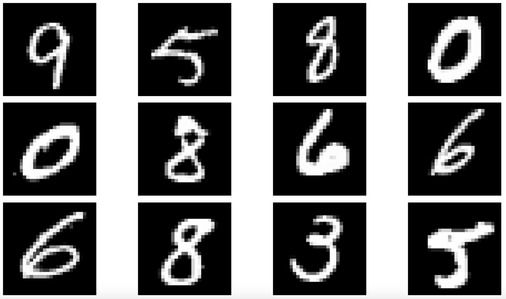

# MNIST Digit Recognition using Keras - Hello World in Neural Networks

This repository contains code in python to recognize handwritten digits using a neural network. The data is available at the [MNIST website](http://yann.lecun.com/exdb/mnist/). The neural network was built using [Keras](https://keras.io/).

## Environment Setup

This project uses Python 3+ and the following packages - Keras, TensorFlow, numpy, matplotlib and various other dependencies. In case you do not have the environment please follow these instructions - 
 
1. Install Docker (https://docs.docker.com/engine/installation/)
2. Run bash command 'docker pull romeo14/neuralnet-toolbox'
3. Run command 'docker run -it romeo14/neuralnet-toolbox'
4. Run command 'conda env list' from inside the container

If step 4 displays nn-tbx-cpu then you are done.

## Data Preparation

Before training the neural network, the MNIST data is loaded and prepared. This data can be found in the [MNIST website](http://yann.lecun.com/exdb/mnist/). The data is split into training, validation and testing dataset. Each image is a numpy array of (784,1) dimension while its label is a one hot encoded data of the 10 digits. For example the label of the digit 1 would be [0 1 0 0 0 0 0 0 0 0]. Also the data is uniformly spread over all the digits and already in grayscale. Normalization or augmentation techniques were not used. Code for exploring the data can be found in file [explore.py]
   
## Neural Network 

The neural newtork is a simple network with 3 layers. The first layer is the input layer with 784 neurons. The second layer consists of 15 hidden neurons. The output layer consists of 10 neurons and is activated by the softmax function. The neural network is built using Keras. The code for this can be found in train.py. Here is a summary of the neural network -
 
| Layer (type)                  | Output Shape         | Param #    | Connected to          |                     
  ----------------------------- |:--------------------:|:----------:|:-------------------- :|
| dense_1 (Dense)               | (None, 15)           | 11775      | dense_input_1[0][0]   |             
| dense_2 (Dense)               | (None, 10)           | 160        | dense_1[0][0]         |                    
| activation_1 (Activation)     | (None, 10)           | 0          | dense_2[0][0]         |  
                  

## Training

The network was trained using a SGD with a learning rate of 0.01 and batch size of 128 until a validation accuracy of 92% was achieved. The code for this can be found in train.py and looks like this - 
  
```
train.py

if __name__ == '__main__':

    # load the data
    X_train, y_train, X_test, y_test, X_val, y_val = load_data()

    # get the model and print summary
    model = get_model()
    model.summary()

    # train the model
    model.compile(loss='categorical_crossentropy', metrics=['accuracy'], optimizer=SGD(lr=0.01))
    history = model.fit(
        X_train, y_train,
        validation_data=(X_val, y_val),
        batch_size=128,
        nb_epoch=30,
        verbose=2
    )

    # save the model to the filesystem
    save_model(model)

    # evaluate the model on the test data and print metrics
    metrics = model.evaluate(X_test, y_test, batch_size=128, verbose=2)
    print("Evaluated model on validation data")
    for metric_i in range(len(model.metrics_names)):
        metric_name = model.metrics_names[metric_i]
        metric_value = metrics[metric_i],
        print('{} {}'.format(metric_name, metric_value))
```

## Prediction

Finally the trained model was used to predict some values from the test dataset. The data selected looked like this -
 
 
 
 | Dataset                 | Values                               |                     
  ------------------------ |:------------------------------------:|
 | Original                | [9, 5, 8, 0, 0, 8, 6, 6, 6, 8, 3, 5] |
 | Predicted               | [9, 4, 8, 0, 0, 8, 6, 6, 6, 8, 3, 5] | 
 
 ## Further Resources
 
 1. http://yann.lecun.com/exdb/mnist/
 2. http://neuralnetworksanddeeplearning.com/chap1.html#a_simple_network_to_classify_handwritten_digits
 3. https://www.tensorflow.org/get_started/mnist/beginners
 